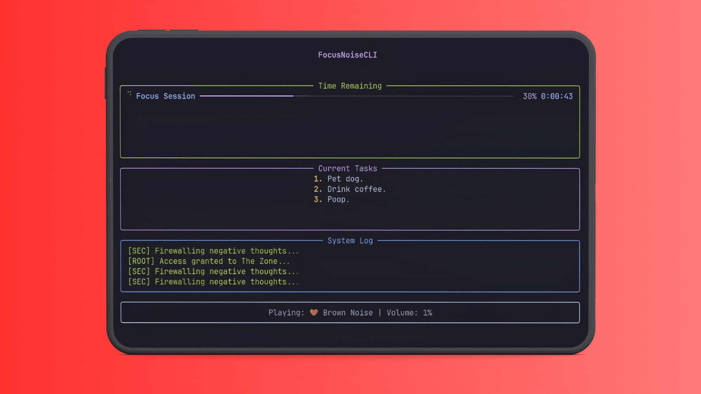

# FocusNoiseCLI 🎧

<p align="center">
  
</p>

**FocusNoiseCLI** is a minimalist, terminal-based focus companion designed for deep work. It blends immersive ambient soundscapes with a professional TUI (Text User Interface), helping you reach flow state while tracking your productivity through a gamified rank system.

Built with **Python**, **Rich**, and **Pygame**, it offers a low-overhead, aesthetic alternative to browser-based noise generators.

---

## ✨ Features

- **🎛️ Layered Audio**: Mix and match multiple high-quality loops (Brown Noise, Rain, Cafe, etc.).
- **🌦️ Dynamic Weather**: Intelligent texture engine that plays subtle SFX (distant thunder, bird chirps) over time for an organic experience.
- **🏆 Gamification**: Progress through 8 ranks from "Noob" to "Time Lord" based on your total focus hours. Maintain daily streaks and earn titles.
- **📋 Task Intent**: Optional task tracking displayed prominently on your dashboard.
- **📟 System Dashboard**: A live, high-performance TUI with progress bars, visualizer-style logs, and session stats.
- **🧾 Session Receipts**: Get an ASCII-styled "Focus Receipt" summarize your achievements after every session.
- **⚙️ Deep Configuration**: Customize everything from fade durations and volume steps to "Ghost" easter egg frequency.

---

## 🚀 Installation

### Arch Linux (Recommended)
FocusNoiseCLI is available on the **AUR**. Install it using your favorite AUR helper:

```bash
yay -S focusnoise-cli-git
```

### Manual Installation (Cross-Platform)
Requires Python 3.8+ and `portaudio` (for pygame).

1. **Clone & Enter**:
   ```bash
   git clone https://github.com/SyreeseOfficial/FocusNoiseCLI.git
   cd FocusNoiseCLI
   ```

2. **Install Dependencies**:
   ```bash
   pip install -r requirements.txt
   ```

3. **Generate Assets** (If starting without your own sounds):
   ```bash
   python setup_assets.py
   ```

4. **Launch**:
   ```bash
   python main.py
   ```

---

## 🛠️ Usage

### Controls
| Key | Action |
|-----|--------|
| `+` / `w` | Increase Volume |
| `-` / `s` | Decrease Volume |
| `Ctrl+C` | End Session & View Receipt |

### CLI Arguments
FocusNoiseCLI supports headless starts for quick productivity:
```bash
# Start a 45-minute rain session at 50% volume immediately
python main.py --quick --sound rain --time 45 --volume 50
```

---

## 📂 Configuration

Settings and focus statistics are stored in OS-standard locations:
- **Linux**: `~/.config/focus-cli/`
- **macOS**: `~/Library/Application Support/focus-cli/`
- **Windows**: `%LOCALAPPDATA%\focus-cli\`

---

## 🗺️ Roadmap

We are constantly evolving the "Zen Terminal" experience. Planned features include:

- [ ] **Custom Themes**: JSON/CSS-like theme support for perfect terminal matching.
- [ ] **Discord Rich Presence**: Share your focus status and rank with your community.
- [ ] **Pomodoro Mode**: Integrated break timers and interval scheduling.
- [ ] **Interactive Mixer**: Adjust individual sound volumes in real-time while focused.
- [ ] **Session Analytics**: Local database for historical focus data and charts.
- [ ] **Remote Control**: Mini-web server to control your terminal audio from a phone.

---

## ⚖️ License

Project is licensed under the [MIT License](LICENSE).

---
<p align="center">Made with ❤️ for the Terminal Community</p>
